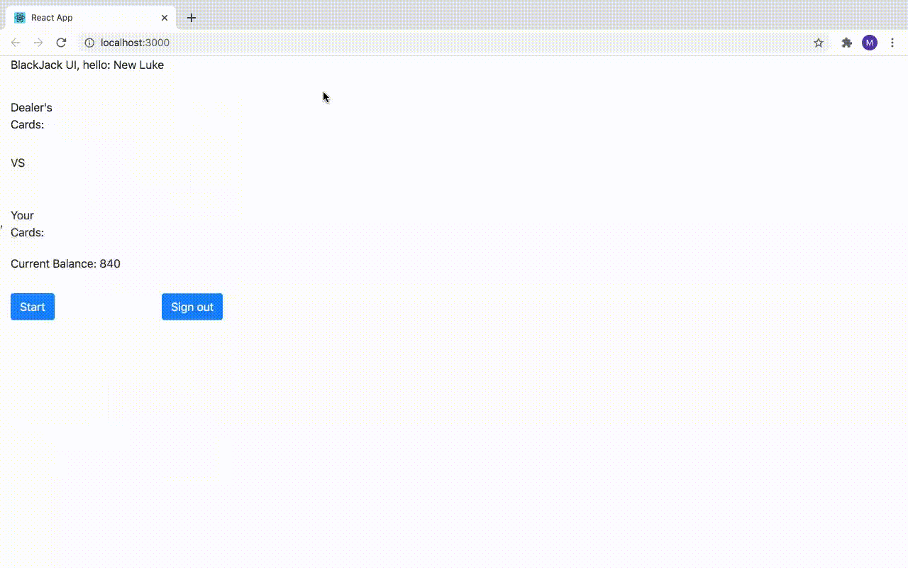

# blackjack_ui
This is a demo for the web UI working with [blackjack_server](https://github.com/lukeZhangMengxi/blackjack_server) and a PostgreSQL database Docker container running locally. Please check out the database setup scripts at [blackjack_server/db](https://github.com/lukeZhangMengxi/blackjack_server/tree/master/db).

<br/>

## To run the project
- Dependency:
    ```
    $ node -v
    v16.15.0

    $ npm -v
    8.5.5

    $ npm install
    ```
- Run it:
    ```
    $ npm start
    ```

<br/>

## Proudly demo

### Player login:


<br/><br/>

### Player signup:


<br/><br/>

### Game tie:


<br/><br/>

### Game win:


<br/><br/>

### Game lose:

